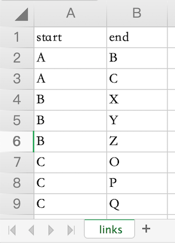

# ExcelToGraphviz

Tool for converting excel sheet to graphviz format.

## Quick Start

With data.xlsx in the root path as follows:


go to the root path in terminal, and run:

> npm run convert

Topology will be opened in default pdf reader.

## Watch mode

> npm run watch:data

Any change on ./data.xlsx will be reflected on pdf which will be automatically opened on default pdf reader.

## Input data

The excel file contains lines, which describing link between nodes.


Excecute command as follows.

> node convert.js data.xlsx

The second argument work as input link data source. `data.xlsx`

## Output graphviz dot file

```
digraph {
    rankdir=LR
    A -> B
    A -> C
    B -> X
    B -> Y
    B -> Z
    C -> O
    C -> P
    C -> Q
}
```

## Output Image


